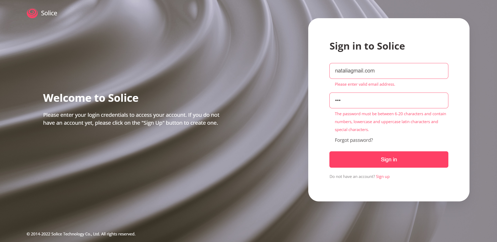

# Login Form

This project is an educational one-page web application that features a login form. It is built using HTML, CSS, and JavaScript with an emphasis on Object-Oriented Programming (OOP) principles.

## Features

- **Login and Registration:** Users can log in with their existing account or create a new one.
- **Password Recovery:** Users have the option to reset their password if forgotten.
- **Client-Side Validation:** Input data is validated on the client side for correctness and completeness.
- **Responsive Design:** The layout is responsive and adapts to different screen sizes.

## Tech Stack

- HTML
- CSS
- JavaScript

## Access the App

You can access the application at the following link: [Solice login Form](https://nataly-horbunova.github.io/Login_form/)

## Screenshots

_Sign in_

_Sign up_

_Forgot password_

## Getting Started

git clone https://github.com/Nataly-Horbunova/Login_form/.git

cd Login_form
